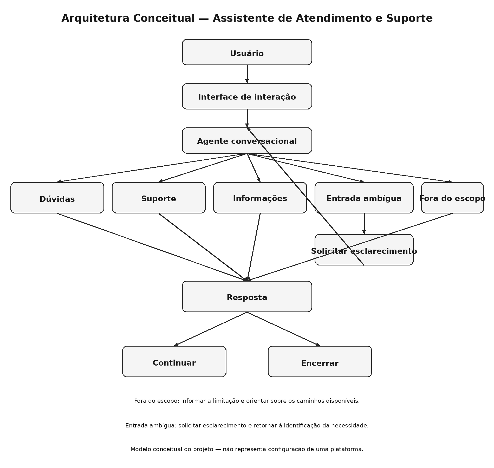
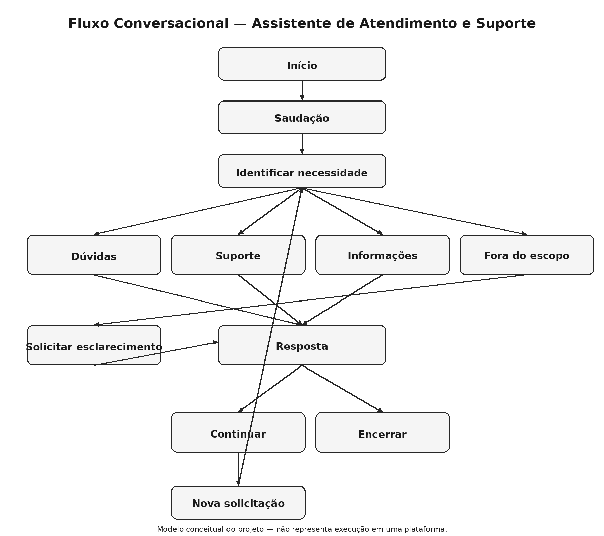

# Diagramas

Esta pasta reúne os diagramas utilizados para explicar visualmente a solução proposta no projeto **Documentação Técnica de um Copiloto com Fluxo de Conversa Personalizado**.

## 1. Objetivo

Os diagramas facilitam a compreensão da arquitetura e do fluxo conversacional definidos para o cenário de Assistente de Atendimento e Suporte.

Eles representam decisões e modelos conceituais elaborados para este projeto.

## 2. Diagrama de arquitetura conceitual

O diagrama apresenta, em alto nível, a relação entre usuário, interface, agente conversacional, identificação da necessidade, caminhos de atendimento, resposta e encerramento ou continuidade.

### Interpretação

- **Usuário:** inicia a interação e fornece a solicitação.
- **Interface:** representa o ponto de entrada e saída da conversa.
- **Agente conversacional:** recebe e processa a solicitação segundo o cenário definido.
- **Identificação da necessidade:** determina o caminho conceitual da conversa.
- **Dúvidas:** trata perguntas e esclarecimentos.
- **Suporte:** trata problemas e solicitações de assistência.
- **Informações:** trata solicitações informativas dentro do cenário.
- **Fora do escopo:** trata solicitações que não pertencem à finalidade definida.
- **Resposta:** apresenta a orientação correspondente.
- **Continuar:** permite uma nova solicitação.
- **Encerrar:** finaliza a interação.

## 3. Diagrama do fluxo conversacional

O fluxo representa a sequência desde o início da interação até a identificação da necessidade, o direcionamento para um caminho de atendimento, a resposta e a continuidade ou encerramento.

### Fluxos alternativos

1. **Entrada ambígua:** o agente solicita esclarecimentos antes de escolher um caminho.
2. **Fora do escopo:** o agente orienta o usuário sobre os caminhos disponíveis.
3. **Continuidade:** o usuário apresenta uma nova solicitação e o fluxo retorna à identificação da necessidade.
4. **Encerramento:** o usuário sinaliza que não deseja continuar e a interação é finalizada.

## 4. Relação com a documentação

| Diagrama | Documento relacionado |
|---|---|
| Arquitetura conceitual | `../docs/02-arquitetura/README.md` |
| Fluxo conversacional | `../docs/03-fluxo-conversacional/README.md` |
| Requisitos | `../docs/05-requisitos/README.md` |
| Testes | `../docs/06-testes/README.md` |
| Resultados | `../docs/07-resultados/README.md` |

## 5. Artefatos da pasta

| Arquivo | Descrição |
|---|---|
| `arquitetura-conceitual.png` | Representação visual da arquitetura do cenário |
| `fluxo-conversacional.png` | Representação visual do fluxo de atendimento |
| `README.md` | Descrição, interpretação e relação dos diagramas com a documentação |

## 6. Referências técnicas

Para afirmações sobre recursos específicos do Microsoft Copilot Studio, deve-se priorizar a documentação oficial da Microsoft Learn.

- [Criar e editar tópicos — Microsoft Learn](https://learn.microsoft.com/pt-br/microsoft-copilot-studio/authoring-create-edit-topics)
- [Gatilhos de tópicos — Microsoft Learn](https://learn.microsoft.com/en-us/microsoft-copilot-studio/guidance/triggering-topics)
- [Tópico de fallback do sistema — Microsoft Learn](https://learn.microsoft.com/pt-br/microsoft-copilot-studio/authoring-system-fallback-topic)

Essas referências fundamentam conceitos da plataforma; os diagramas representam decisões de projeto elaboradas para este repositório.

---

**Projeto:** Documentação Técnica de um Copiloto com Fluxo de Conversa Personalizado

**Autora:** Nágyla Silva

Projeto integrante do portfólio prático em Inteligência Artificial,
desenvolvido para demonstrar competências em treinamento e avaliação de
sistemas de IA, análise crítica de respostas e anotação de dados, aplicadas às
funções de AI Trainer, AI Response Evaluator e Data Annotator, com base em
experiência em QA e Auditoria.